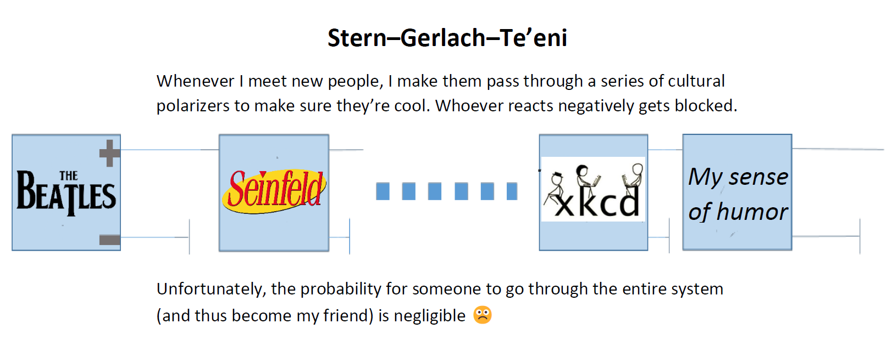

[← Back to Main Page](/)

---

# Jokes & Fun

This is the collection of my social media posts, thoughts, and writings from over the years.

## Hebrew (ניב מקומי)

<ul>
  <li><a href="archive/he/2017-04-14-abuse-1">Abuse of Notation</a></li>
  <li><a href="archive/he/2017-04-10-quote">ציטוט</a></li>
  <li><a href="archive/he/2017-04-10-languages">שפות</a></li>
</ul>

## English (Nonlocal Dialect)
<ul>
  <li><a href="archive/en/2026-07-10-legumes">Legumes</a></li>
  <li><a href="archive/en/2026-06-28-auditor">Auditor</a></li>
  <li><a href="archive/en/2026-03-14-into-you">Is she into you?</a></li>
  <li><a href="archive/en/2018-09-19-paradox">Paradox</a></li>
  <li><a href="archive/en/2018-09-18-date">Date</a></li>
</ul>
